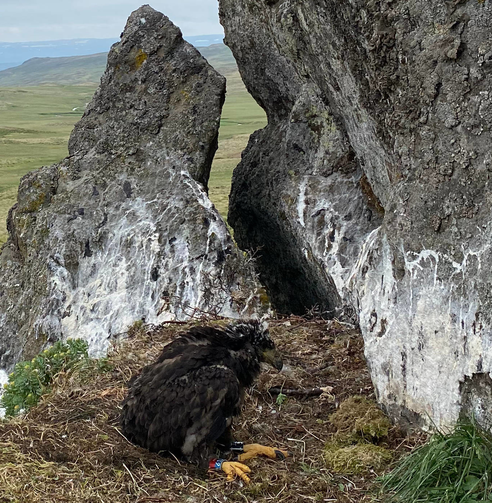

class: title-slide
<br><br><br><br><br>
# .font5.font-dance.yellow[Ársskýrsla]
<br>
## .font2.yellow[Náttúrustofu Norðurlands vestra]

---
class: class: split-two with-thick-border border-white duke-softblue

```{r setup, include=FALSE}
options(htmltools.dir.version = FALSE)
```


.column[.content.pad1[

<br>
<br>

# .font-dance[Efnisyfirlit]
### Inngangur

### Starfsmenn

### Rannsóknir

### Þjónusta við almenning

### Fjölmiðlar

]]

.column[.content.nopadding[

.img-fill[]
.footnote.black[
Stuðlaberg við Friðmundarvötn. Græna steindin sem litar bergið er sjaldgæf steind sem enn er ógreind og er til rannsóknar hjá sérfræðingum Náttúrufræðistofnunar.
]

]
]

---
class: split-60 with-border 

.column[.content[
# .font-dance[Inngangur]

Starf náttúrustofunar í ár var að venju fjölbreytt og áhugavert. Farið var víða um Norðurland vestra til náttúruathugana og rannsókna enda er af nógu að hyggja á landsvæði sem spannar 13.105 km2.

Viðfangsefni náttúrustofunnar snérust að miklu leyti um vöktun náttúru svæðisins, dýra- og plöntulífs og jarðminja auk þess að svara almennum fyrirspurnum, hjúkra villtum dýrum í neyð og taka þátt í fræðslu ungmenna á svæðinu. Fylgst var með fuglum sem og ágengum plöntutegundum ásamt ágengum dýrum líkt og minkum og refum.

   Um vorið voru gerðar athuganir á gæsum yfir landsvæðið þvert og endilangt, frá Fljótum í Skagafirði til Bitrufjarðar á Ströndum. Eins var farið norður á Skaga og suður að Ingólfskála og að Hofsjökli til að skoða jökulröndina en þaðan er uppganga á jökulinn hvað auðveldust. Jafnframt var farið um heiðalöndin yfir sumarið og athuganir gerðar við Orravatnsrústir á Stórasandi og á Arnarvatnsheiði.

   Náttúrustofan hefur unnið mikið starf við verkefnið „Vöktun náttúruverndarsvæða“ sem er leitt af Náttúrufræðistofnun Íslands og unnið í samstarfi við allar náttúrustofurnar sem eru dreifðar um landið. *Gerðar voru úttektir á náttúruverndarstöðum og ferðamannastöðum til að meta ástand þeirra og mögulegar ógnir sem að þeim sækir og fylgir gjarnan auknum ferðamannastraumi, sérstaklega ef innviði vantar og eftirliti er ábótavant.* Náttúruverndarsvæði Norðurlands vestra og aðrir vinsælir ferðamannastaðir eru mikil verðmæti sem skapa miklar tekjur í ferðamennsku. Þeir hafa mikið gildi í sjálfu sér og eru framtíðarverðmæti komandi kynslóða.
   
Á Norðurlandi vestra eru þónokkur náttúruverndarsvæði og all mörg önnur svæði sem ekki njóta beinnar náttúruverndar en teljast afar mikilvæg fyrir náttúru Íslands. Má hér til dæmis nefna hin víðáttumiklu vatna- og heiðasvæði Guðlaugstungur og Arnarvatnsheiði og einnig Skagaheiðina, Eylendið í Skagafirði eða Flóðið og Eylendið í Vatnsdal, fuglabjörgin í Drangey og Málmey. Strandlónin Höfðavatn og Sigríðarstaðavatn bera einnig mikið og fjölbreytt fuglalíf. Það hefur fallið að nokkru leiti í hlut náttúrustofunnar að fylgjast með þessum stöðum, skrásetja og telja fugla og plöntur.

  ]]
 
.column[.content.nopadding[

.img-fill[]

.footnote.black.content-box-blue[

Orkídeutegundin kræklurót, er fremur sjaldgæf sníkjujurt án blaðgrænu. Kræklurótin finnst nokkuð víða í héraðinu.
]
]]

???
Orkídeutegundin kræklurót, er fremur sjaldgæf sníkjujurt án blaðgrænu.

---

class: split-60 with-border middle


.column[.content.nopadding[

.img-fill[]
.footnote.green[
Gróðurvist á hálendinu. Snjómosi. Hér má sjá fræ grasvíðis (hvítu hárin með daggardropunum), kornsúru og snjómosa.
]


]]

.column[.content[


Norðurland vestra hefur því miður orðið mjög útundan þegar að kemur að innviðauppbygingu og eftirliti á náttúruverndarsvæðum og annarra staða með merkilegt náttúrufar, svo sem merkar jarðminjar eða ríkulegt fuglalíf. Landverðir á vegum Umhverfistofnunar eru ekki starfandi á svæðinu fyrir utan vikulega heimsókn á Hveravelli yfir háferðamannatímann en því er sinnt af landverði frá Kerlingarfjöllum þó vissulega tilheyri Hveravellir Norðurlandi vestra. Þessi skortur á landvörslu er mjög bagalegur sem víða má sjá í tengslum við gerð og viðhald gönguleiða sem hefur aðalega fallið í hlut sveitarfélaganna á svæðinu. Rétt er að geta þess að Hveravellir eru sennilega annar fjölsóttasti ferðamannastaður á hálendi Íslands á eftir Landmannalaugum.

Guðlaugstungur eru víðáttumikið friðland á hálendinu sunnan Blöndulóns. Þar er allmikil ferðamennska, sérstaklega reiðhópa og jeppafólks eða fólki á léttari torfærutækjum. Guðlaugstungur eru með stærsta varp heiðagæsa í heiminum og hafa slegið út Þjórsárver í þeim efnum. Ekki er óalgengt að að sjá sjaldgæfa fugla þar á sveimi líkt og haferni, fálka og snæuglur. Mikilvægi svæðisins er óumdeilt og nauðsynlegt er að huga vel að þessu svæði, sem og öðrum svæðum sem nefnd voru hér að ofan, til framtíðar.   

Náttúrustofan hefur notið góðs samstarfs við rannsóknarstofnanir á svæðinu. Á Skagaströnd deilum við skrifstofuhúsnæði og rannsóknaraðstöðu með BioPol en þar á milli hefur verið ríkt samstarf t.d. í strandvöktun á vegum OSPAR, þang- og þararannsóknir og vöktun á örplasti í Húnaflóa. Á Hvammstanga erum við undir sama þaki og starfsfólk Hafró, Selasetursins og Háskólans á Hólum. Þar er t.d. unnið að fræðsluverkefni fyrir unglinga og rannsóknum á ferðamennsku í kringum selaskoðun. Höfuðstöðvarnar eru sem áður við Aðalgötu 2 á Sauðárkróki með skrifstofu og rannsóknaraðstöðu. 

 
 
  ]]
 

---
class: top
background-image: url(myndir/BJ.JPG)
background-size: cover

.pull-left[
.content-box-blue[

Bjarni Jónsson, forstöðumaður, var kosinn á þing á árinu og lét af störfum. Við þökkum honum fyrir samstarfið og óskum honum velfarnaðar á nýjum vettvangi.
]
]


---

class: top
background-image: url(myndir/einar.jpeg)
background-size: contain

.pull-right[


# .black.font-dance[Starfsmenn]
Einar Ó. Þorleifsson, náttúrufræðingur. Sér um athuganir á fuglum, plöntum og jarðfræði.

]

---

class: split-40 with-border middle


.column[.content[
# .black.font-dance[Starfsmenn]
Valtýr Sigurðsson, líffræðingur, er í hálfu starfi hjá stofunni á móti starfi sínu hjá BioPol. Hann sinnir rannsóknum á örplasti, botndýrum í sjó, þara og almennu náttúrufari á svæðinu. 


]]

.column[.content.nopadding[

.img-fill[]


]]


---

class: split-60 with-border middle


.column[.content.nopadding[

.img-fill[]


]]

.column[.content[


# .black.font-dance[Starfsmenn]
Cecile Chauvat, verkfræðingur í fjarskiptatækni (MSc.). haf- og strandsvæðastjórnun (MIM.), hefur verið í hlutastarfi hjá NNV í tengslum við fræðsluverkefni á vegum NORA-sjóðsins og verkefni á vegum loftlagssjóðs/Rannís.


]]


---

class: top
background-image: url(myndir/geislar.png)
background-size: contain

# .yellow.font-dance[Rannsóknir. Kristalholufylling úr Hegranesi í Skagafirði. Kristalnálarnar eru litaðar af fágætu efnasambandi.]


---
layout:false
class: split-40 bg-white with-border
background-image: url(myndir/ashildur.JPEG)
background-size: cover

.row[


]

.row[
  .split-three.with-border[
  .column.bg-white[.content[
  .font2[Athuganir]
  
Örplast og Yann, þangrannsóknir hafa einnig nýst til að bæta við þekkingu bjargfugla, fundum fyrsta staðfesta toppskarfshreiður á Norðurlandi. 


    ]]

.column.bg-white[.content[

.large[Steinar og steingervingar:] Nýr fundarstaður steingervinga frá tertíertímanum (ca. 6-8 milljón ár) fannst í afar fallegu gili sem nefnist Hrútagil og er í Vesturdal í Skagafirði, enn sem komið er hefur aðallega fundist þar surtarbrandur en hann er kolaðarleifar milljóna ára gamalla trjá einnig er að finna þar fíngert set með öðrum plöntuleifum sem mjög áhugavert verður að skoða nánar. Ýmsar fágætar tegundir steinda og kristalla fundust einnig í Hegranesi og á Vatnsnesi og verður þeirra getið nánar eftir frekari greiningar. Töluvert hefur einnig fundist af málmsteindum og verður mjög áhugavert að fá frekari greiningar á þeim.

  ]

  ]
  .column.bg-white[.content[
  .large[Sjaldgæfar plöntur og slæðingar] voru víða skráðar samhliða öðrum rannsóknum, merkilegast má telja fágætar jurtir sem eru að berast víða inn um hálendið með erlendum ferðamönnum. Má hér helst geta fagurfífils, regfangs afbrigðis og sólfylgju sem nú eru á Hveravöllum. Hvað áhugaverðasta plantan sem fannst á láglendi var stúfa en stúfan hefur annars einungis vaxtarstaði á Suðurlandi.

.large[Skordýr] fáein merkileg skordýr fundust og má þar helst geta kóngasvarma, aðmírálsfiðrildis og gammayglu. Einnig fannst tegund af stórvaxinni skortítu í varningi sem kom erlendis frá.

  ]]
]]

---
layout:false
class: split-40 bg-white with-thick-border
background-size: cover

.row[

Starfsmenn náttúrustofunnar tóku þátt í arnarmerkingum með starfsmönnum Náttúrufræðistofnun Íslands. Alls voru merktir arnarungar á 4 hreiðrum á okkar svæði.
Elínór. Fuglorðinn fálkakarl sem fannst slasaður í Hrútafirði. Hann var fóðraður og hjúkrað í nokkrar vikur og komið til heilsu. Hann var svo fluttur í Húsdýragarðinn. 


]

.row[
  .split-three.with-thick-border[
  .column[.nopadding[

  .img-fill[]


  ]]

.column.bg-white[.nopadding[

 .img-fill[]

  ]

  ]
  .column.bg-white[.nopadding[

  .img-fill[]

  ]]
]]

---
layout:false
class: split-40 bg-white with-thick-border
background-size: cover

.row[

Starfsmenn náttúrustofunnar tóku þátt í arnarmerkingum með starfsmönnum Náttúrufræðistofnun Íslands. Alls voru merktir arnarungar á 4 hreiðrum á okkar svæði.
Elínór. Fuglorðinn fálkakarl sem fannst slasaður í Hrútafirði. Hann var fóðraður og hjúkrað í nokkrar vikur og komið til heilsu. Hann var svo fluttur í Húsdýragarðinn. 


]

.row[
  .split-three.with-thick-border[
  .column[.nopadding[

  .img-fill[]


  ]]

.column.bg-white[.nopadding[

 .img-fill[]

  ]

  ]
  .column.bg-white[.nopadding[

  .img-fill[]

  ]]
]]

---
layout:false
class: split-60 bg-white with-thick-border
background-size: cover


.row[
  .split-three.with-thick-border[
  .column[.nopadding[

  .img-fill[]


  ]]

.column.bg-white[.nopadding[

 .img-fill[]

  ]

  ]
  .column.bg-white[.nopadding[

  .img-fill[]

  ]]
]]

.row[

Starfsmenn náttúrustofunnar tóku þátt í arnarmerkingum með starfsmönnum Náttúrufræðistofnun Íslands. Alls voru merktir arnarungar á 4 hreiðrum á okkar svæði.
Elínór. Fuglorðinn fálkakarl sem fannst slasaður í Hrútafirði. Hann var fóðraður og hjúkrað í nokkrar vikur og komið til heilsu. Hann var svo fluttur í Húsdýragarðinn. 

Myndaskölun 5333:5400


]

---
class: top split-three
background-image: url(myndir/DAPHNIA_PULEX_STUTTHALAFLÓ.JPG)
background-size: cover

.column[.content[

## .yellow[Fuglar] 
.Large[.yellow[Örplast]]

.yellow[BioPol og Náttúrustofan hafa unnið að rannsóknum á örplasti í Húnaflóa. Í undirbúningi er grein um niðurstöður þeirra]

.Large[.yellow[Þari]]

.yellow[BioPol og Náttúrustofan hafa unnið að rannsóknum
á örplasti í Húnaflóa. Í undirbúningi er grein um niðurstöður þeirra]

.Large[.yellow[Botndýr]]

.yellow[BioPol og Náttúrustofan hafa unnið að rannsóknum
á örplasti í Húnaflóa. Í undirbúningi er grein um niðurstöður þeirra]
 
  ]]
.column[.content[

## .yellow[Sjór] 
.Large[.yellow[Örplast]]

.Large[.yellow[Þari]]

.yellow[BioPol og Náttúrustofan hafa unnið að rannsóknum
á örplasti í Húnaflóa. Í undirbúningi er grein um niðurstöður þeirra]

.Large[.yellow[Botndýr]]

]]
.column[.content[

## .yellow[Vöktun] 
.Large[.yellow[Örplast]]

.yellow[BioPol og Náttúrustofan hafa unnið að rannsóknum á örplasti í Húnaflóa. Í undirbúningi er grein um niðurstöður þeirra]

.Large[.yellow[Þari]]

.Large[.yellow[Botndýr]]

..yellow[rósastari þessi fágæti flækingur frá Steppum Kasakstan kom á Hvammstanga í lok ágúst og hélt til í garði fuglavina við gotatlæti þar til hann var drepinn af ketti rétt fyrir jól.  Þetta er í þriðja sinn sem þessi sjaldgæfa fuglategund finnst  á Norðurlandi - Vestra, skeiðönd skeiðendur fundust að þessu sinni í Glaumbæjarey í Skagafirði og Miðfirði,  Hrafnsönd, fáeinar hrafnsendur hafa sést í Skagafirði undanfarin ár við Miklavatn og ósa Héraðsvtnanna eins sjást þær við Friðmundarvötn á hálendinu.  Líiklega eru þær enn fágætir varpfuglar á svæðinu., Æðarkóngur sást um vorið við Blönduós Söngþröstur,hettusöngvari, landsvala, og flekkugrípur sá síðast nefndi er fremur fátíður flækingur hérlendis.  Flekkugrípar verpa víða á Norðurlöndunum..  Flekkugrípurinn var sá fyrsti sem sést á Norðurlandi.  Snæugla náttúrustofan fékk fréttir af einn snæuglu á hefðbundnum slóðum við gróðurvin á auðnum Miðhálendisins.]


]]


---

class: inverse, bottom, center
background-image: url(myndir/kongasvarmi.png)
background-size: contain

Þessi sjaldgæfi kóngasvarmi fannst á Hvammstanga. Hann er með allra stærstu næturfiðrildum sem hér finnast, með 8 til 10 cm vænghaf og er eitt stærsta skordýr Evrópu. Þetta er sjaldgæfur flækur sem berst með síðsumarvindum. Náttúrustofan tekur við ábendingum og hjálpar til við greiningar.

---

class: inverse, bottom, center
background-image: url(myndir/stufa_og_gullspor.png)
background-size: contain

.font3[Fyrsta skipti á Norðurlandi fágæt jurt sem heitir stúfa (Succisa pratensis) kíkja á útbreiðslukort NÍ. Gullsporablóm (Linaria vulgaris). Finnst einum stað á Holtavörðuheiði og einum stað í Refasveit. Fyrir utan þessa nýju fundarstaði á Norðurlandi vestra þá finnst gullsporablóm aðeins á tveimur öðrum stöðum á landinu. Slæðingar: eru erlendar innfluttar plöntutegundir sem berast óvart með manninum eða innflutningi. Þetta eru plöntur sem geta náð hér fótfestu.]


---


class: inverse
background-image: url(myndir/bakkabrunir.jpg)
background-size: contain

### Bakkabrúnir steingervingar
.font3[Undanfarin ár hafa steingervingar verið athugaðir í Bakkabrúnum. Þar finnast vel varðveitt blaðför meðal annars af birki og elri. Steingervingarnir eru frá hlýskeiði ísaldar.
]
---

class: inverse, middle, center
background-image: url(myndir/Skotta_jardvegssnid.jpg)
background-size: contain

### Jarðvegssnið
Náttúrustofan hefur fengið til liðs við sig jarðfræðinga frá Háskóla Íslands og Vegagerðinni til að staðfesta aldur Vatnsdalshólanna. Með aldursgreingum og öskulagatímatali. Á myndinni má sjá jarðvegssnið með öskulagi úr Heklu.
---

class: inverse, middle, center
background-size: contain

Farið var af stað með vöktunarverkefni sem að nefnist Vöktun náttúruverndarsvæða árið 2020. Náttúrustofan hefur tekið drjúgan þátt í þeví og safnað gríarmikið af upp um nátturfar þessara svæða ásamt því að gera ástandsmat á stöðunum m.t.t. til margvíslegra ógna  m.a. ágangs ferðamanna.

Sjaldgæfir gestir og áhugaverðar athuganir úr fuglalífinu

Rósastari, þessi fágæti flækingur frá Steppum Kasakstan kom á Hvammstanga í lok ágúst og hélt til í garði fuglavina við gott atlæti þar til hann var drepinn af ketti rétt fyrir jól. Þetta er í þriðja sinn sem þessi sjaldgæfa fuglategund finnst á Norðurlandi vestra. 


Skeiðönd: Skeiðendur fundust að þessu sinni í Glaumbæjarey í Skagafirði og Miðfirði, Hrafnsönd, fáeinar hrafnsendur hafa sést í Skagafirði undanfarin ár við Miklavatn og ósa Héraðsvtnanna eins sjást þær við Friðmundarvötn á hálendinu. Líklega eru þær enn fágætir varpfuglar á svæðinu.

Æðarkóngur sást um vorið við Blönduós Söngþröstur,hettusöngvari, landsvala, og flekkugrípur sá síðast nefndi er fremur fátíður flækingur hérlendis. Flekkugrípar verpa víða á Norðurlöndunum. Flekkugrípurinn var sá fyrsti sem sést hefur á Norðurlandi. Snæugla náttúrustofan fékk fréttir af einn snæuglu á hefðbundnum slóðum við gróðurvin á auðnum Miðhálendisins.

Gargönd nokkuð sást af gargöndum í Skagafirði en þar verpa fáeinir tugir para þessarar annars fágætu andategundar sem annars er aðallega bundin við Mývatn og Laxá ásamt Aðaldal. Grafendur finnast nokkuð víða um héraðið en eru þó mjög fáliðaðar þó nóg sé kjörlendið í Eylendi Skagafjarðar og votlendi í Vatnsdal.

 fálki minna um varp en undanfarin ár enda er fremur lítið af rjúpum sem eru mikilvægasta fæða fálkans. Ernir sáust víða og má teljast merkilegt hvað þeir eru tíðir á Arnarvatnsheiði og á Miðhálendinu t.d. Ásbjarnarvötn í um 700 mys.

Nýbúum svartþresti, glókolli og krossnef heldur hægt og bítandi áfram að fjölga sem og öðrum fuglum sem njóta góðs af trjárækt og vaxandi skógum. Starar hafa einnig náð nokkuð öruggri fótfestu í bæjum og sveitum en þeir eru að miklu leyti farfuglar sem sennilega far til Suðvesturlands til vetrardvalar en snú aftur í mars lok.
