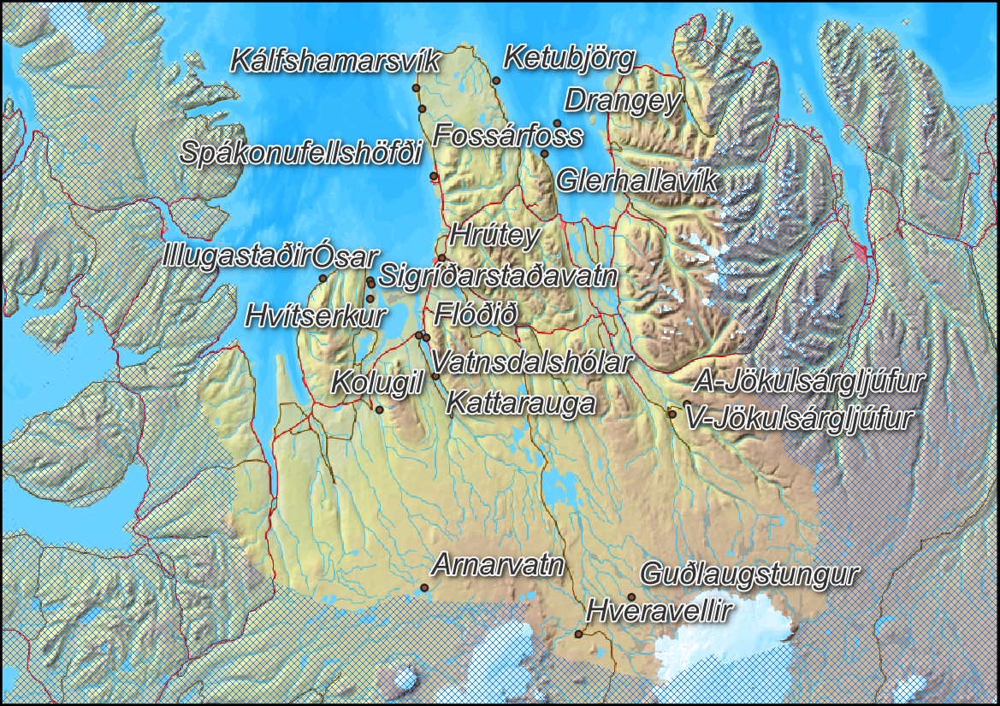
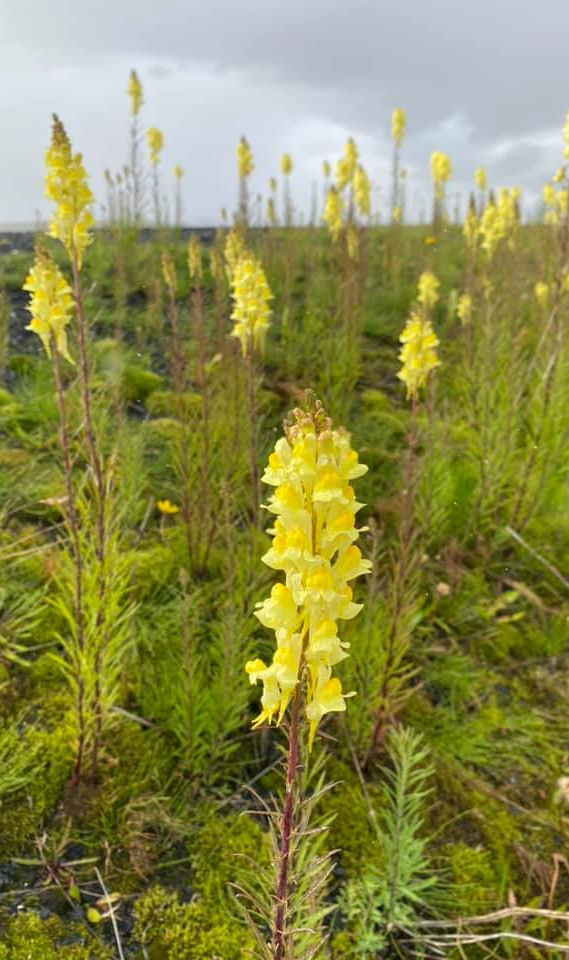
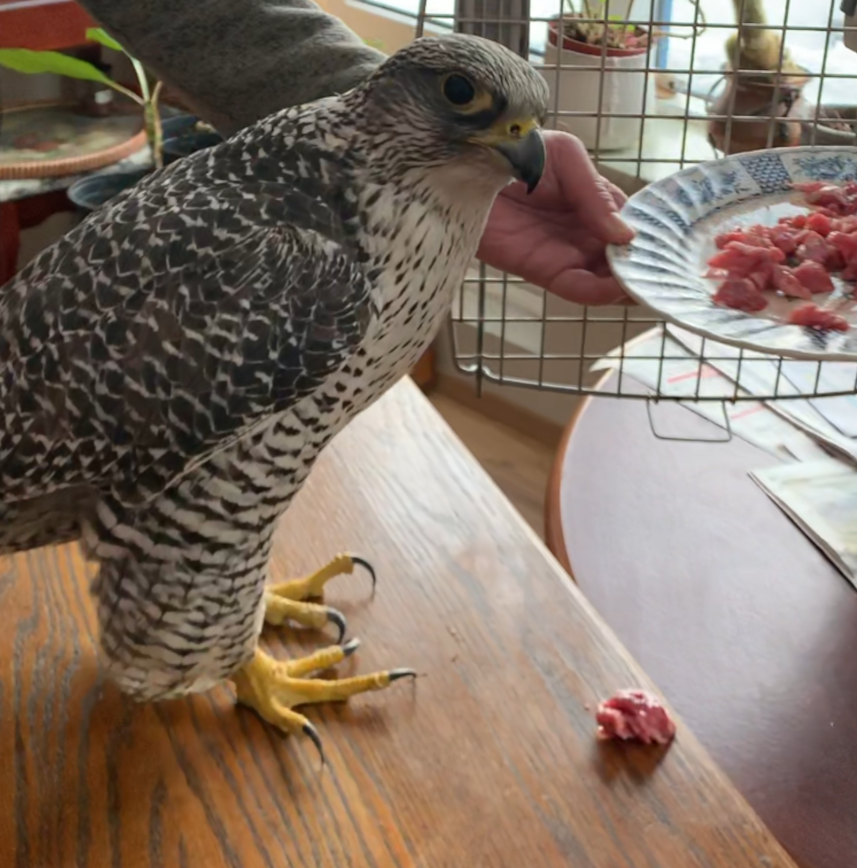

class: title-slide
<br><br><br><br><br>
# .font5.font-dance.yellow[Ársskýrsla]
<br>
## .font2.yellow[Náttúrustofu Norðurlands vestra]

---
class: class: split-two with-thick-border border-white duke-softblue

```{r setup, include=FALSE}
options(htmltools.dir.version = FALSE)
```


.column[.content.pad1[

<br>
<br>

# .font-dance[Efnisyfirlit]
### [Inngangur](#inngangur)

### [Starfsmenn](#starfsmenn)

### [Helstu viðfangsefni](#vidfangsefni)

### [Erindi](#erindi)

### [Fjölmiðlar](#fjolm)

### [Ýmislegt](#ymislegt)


]]

.column[.content.nopadding[

.img-fill[]
.footer-note-black-R.white.scriptsize[
Stuðlaberg við Friðmundarvötn. Græna steindin sem litar bergið er sjaldgæf steind sem enn er ógreind og er til rannsóknar hjá sérfræðingum Náttúrufræðistofnunar.
]

]
]

---
class: split-60 with-border 
name: inngangur
.column[.content[
# .font-dance[Inngangur]

Starf Náttúrustofu Norðurlands vestra í ár var að venju fjölbreytt og áhugavert. Farið var víða um landshlutann til náttúruathugana og rannsókna enda er af nógu að hyggja á landsvæði sem spannar 13.105 km<sup>2</sup>.

Viðfangsefni Náttúrustofunnar snérust að miklu leyti um vöktun náttúru svæðisins, dýra- og plöntulífs og jarðminja auk þess að svara almennum fyrirspurnum, hjúkra villtum dýrum í neyð og taka þátt í fræðslu ungmenna á svæðinu. Fylgst var með fuglum sem og ágengum plöntutegundum ásamt ágengum dýrum, líkt og minkum og refum.

   Um vorið voru gerðar athuganir á gæsum yfir landsvæðið þvert og endilangt, frá Fljótum í Skagafirði til Bitrufjarðar á Ströndum. Eins var farið norður á Skaga og suður að Ingólfsskála og að Hofsjökli til að skoða jökulröndina en þaðan er uppganga á jökulinn hvað auðveldust. Jafnframt var farið um heiðalöndin yfir sumarið og athuganir gerðar á Arnarvatnsheiði og við Orravatnsrústir á Stórasandi.

   Náttúrustofan hefur unnið mikið starf við verkefnið „Vöktun náttúruverndarsvæða“ sem er leitt af Náttúrufræðistofnun Íslands og unnið í samstarfi við allar náttúrustofur landsins. Gerðar voru úttektir á náttúruverndarstöðum og ferðamannastöðum til að meta ástand þeirra og mögulegar ógnir sem að þeim sækja og fylgja gjarnan auknum ferðamannastraumi, sérstaklega ef innviði vantar og eftirliti er ábótavant. Náttúruverndarsvæði Norðurlands vestra og aðrir vinsælir ferðamannastaðir eru mikil verðmæti sem skapa miklar tekjur í ferðamennsku. Þeir hafa mikið gildi í sjálfu sér og eru framtíðarverðmæti komandi kynslóða.
   
Á Norðurlandi vestra eru þónokkur náttúruverndarsvæði og allmörg önnur svæði sem ekki njóta beinnar náttúruverndar en teljast afar mikilvæg fyrir náttúru Íslands. Má hér til dæmis nefna hin víðáttumiklu vatna- og heiðasvæði Guðlaugstungur og Arnarvatnsheiði og einnig Skagaheiðina, Eylendið í Skagafirði eða Flóðið og Eylendið í Vatnsdal, fuglabjörgin í Drangey og Málmey. Strandlónin Höfðavatn og Sigríðarstaðavatn bera einnig mikið og fjölbreytt fuglalíf. Það hefur fallið að nokkru leyti í hlut Náttúrustofunnar að fylgjast með náttúrufari á þessum stöðum og   sinna rannsóknum og eftirliti.

  ]]
 
.column[.content.nopadding[

.img-fill[]

.footer-note-black.white.scriptsize[
Orkídeutegundin kræklurót, er fremur sjaldgæf sníkjujurt án blaðgrænu. Kræklurótin finnst nokkuð víða í héraðinu.
]
]]

???
Orkídeutegundin kræklurót, er fremur sjaldgæf sníkjujurt án blaðgrænu.

---

class: split-60 with-border middle


.column[.content.nopadding[

.img-fill[]
.footer-note-black.white.scriptsize[
Gróðurvist á hálendinu. Snjómosi. Hér má sjá fræ grasvíðis (hvítu hárin með daggardropunum), kornsúru og snjómosa.
]


]]

.column[.content[
Áhersla er lögð um allt land á innviðauppbyggingu og eftirlit með náttúruverndarsvæðum og öðrum stöðum með merkilegt náttúrufar, svo sem merkum jarðminjum eða ríkulegu fuglalífi. Á Norðurlandi vestra finnast margir staðir sem tilheyra þessum flokki og með áframhaldandi uppbyggingu innviða þeirra er hægt að koma í veg fyrir að landshlutinn dragist aftur úr öðrum. Landverðir á vegum Umhverfisstofnunar eru ekki starfandi á svæðinu og er það bagalegt. Sem dæmi má nefna að gerð og viðhald gönguleiða bera þess víða merki, en sú vinna hefur aðallega fallið í hlut viðkomandi sveitarfélaga. Yfir háferðamannatímann er eftirliti á Hveravöllum sinnt vikulega af landverði sunnan úr Kerlingafjöllum. Hveravellir tilheyra þó vissulega Norðurlandi vestra og eru sennilega annar fjölsóttasti ferðamannastaður á hálendi Íslands á eftir Landmannalaugum.

Guðlaugstungur eru víðáttumikið friðland á hálendinu sunnan Blöndulóns. Þar eru tíðar ferðir reiðhópa og fólks á jeppum eða léttari torfærutækjum á sumrin. Guðlaugstungur eru með stærsta varp heiðagæsa í heiminum, jafnvel stærra en í Þjórsárverum. Ekki er óalgengt að að sjá sjaldgæfa fugla þar á sveimi líkt og haferni, fálka og snæuglur. Mikilvægi svæðisins er óumdeilt og nauðsynlegt er að huga vel að þessu svæði, sem og öðrum svæðum sem nefnd voru hér að ofan, til framtíðar.   

Náttúrustofan hefur notið góðs samstarfs við rannsóknarstofnanir á svæðinu. Á Skagaströnd deilum við skrifstofuhúsnæði og rannsóknaraðstöðu með BioPol en þar á milli hefur verið ríkt samstarf t.d. í strandvöktun á vegum OSPAR, þang- og þararannsóknum og vöktun á örplasti í Húnaflóa. Á Hvammstanga erum við undir sama þaki og starfsfólk Hafró, Selasetursins og Háskólans á Hólum. Þar er t.d. unnið að fræðsluverkefni fyrir unglinga og rannsóknum á ferðamennsku í kringum selaskoðun. Höfuðstöðvar Náttúrustofunnar eru sem áður við Aðalgötu 2 á Sauðárkróki en þar er skrifstofa og rannsóknaraðstaða. 

 
 
  ]]
 

---
class: top
background-image: url(myndir/BJ.JPG)
background-size: cover

.pull-left[
.content-box-blue[

Bjarni Jónsson, forstöðumaður, var kosinn á þing á árinu og lét af störfum. Við þökkum honum fyrir samstarfið og óskum honum velfarnaðar á nýjum vettvangi.
]
]


---

class: top
name: starfsmenn
background-image: url(myndir/einar.jpeg)
background-size: contain

.pull-right[


# .black.font-dance[Starfsmenn]
Einar Ó. Þorleifsson, náttúrufræðingur. Sér um athuganir á fuglum, plöntum og jarðfræði.

]

---

class: split-40 with-border middle


.column[.content[
# .black.font-dance[Starfsmenn]
Valtýr Sigurðsson, líffræðingur, er í hálfu starfi hjá stofunni á móti starfi sínu hjá BioPol. Hann sinnir rannsóknum á örplasti, botndýrum í sjó, þara og almennu náttúrufari á svæðinu. 


]]

.column[.content.nopadding[

.img-fill[]


]]


---

class: split-60 with-border middle


.column[.content.nopadding[

.img-fill[]


]]

.column[.content[


# .black.font-dance[Starfsmenn]
Cecile Chauvat, verkfræðingur í fjarskiptatækni (MSc.). haf- og strandsvæðastjórnun (MIM.), hefur starfað í tengslum við fræðsluverkefni á vegum NORA-sjóðsins og verkefni á vegum loftlagssjóðs/Rannís.


]]


---
layout: false
name: vidfangsefni
background-image: url(myndir/breyttar/kattarauga.JPEG)
background-size: cover

.white.font-dance.font5[Helstu viðfangsefni...]
 .footer-note-black.white[
 Kattarauga í Vatnsdal er lítil djúp tjörn með gróðurhólmum sem aðskiljast líklega frá bökkunum og fljóta út á tjörnina. Kattarauga er friðlýst náttúruvætti. 
 ]
---

layout:false
class: split-40 bg-white with-border bottom
background-image: url(myndir/ashildur.JPEG)
background-size: cover

.row[
.font2[Farið var af stað með vöktunarverkefni sem að nefnist **Vöktun náttúruverndarsvæða** árið 2020. Náttúrustofan hefur tekið drjúgan þátt í því og safnað gríðarmikið af upplýsingum um nátturfar þessara svæða ásamt því að gera ástandsmat á stöðunum með tilliti til margvíslegra ógna meðal annars ágangs ferðamanna.
]
]

.row[
  .split-two.with-border[
  
  .column.bg-white[.nopadding[

  .img-fill[]
  
  ## .footer-note.font_large[2020]

  ]]

  .column.bg-white[.nopadding[

  .img-fill[]
  
  ## .footer-note.font_large[2021]

  ]]
]]

---

class: split-four
background-image: url(myndir/Drangey_sky.JPG)
background-size: contain

.column.bg-main1[.content.vmiddle.nopadding[
.footer-note-R[Dróni var keyptur í tengslum við vöktun náttúruverndarsvæða árið 2020. Hann hefur verið notaður við kortlagningu og ýmislegt fleira.]
  .img-fill[]
]]
.column.bg-main2[.content[

]]
.column.bg-main3[.content.vmiddle.center[

]]
.column.bg-main4[.content[
.footnote.Large.white[Drangey]
]]

---


layout:false
class: split-10
background-image: url(myndir/odinshani.JPG)
background-size: cover

.row[
.content.justify-right.white[
## Sjaldgæfir gestir og áhugaverðar athuganir úr fuglalífinu

]]
.row.white[
.split-two[
.column[
]
.column[

Rósastari, þessi fágæti flækingur frá Steppum Kasakstan kom á Hvammstanga í lok ágúst og hélt til í garði fuglavina við gott atlæti þar til hann var drepinn af ketti rétt fyrir jól. Þetta er í þriðja sinn sem þessi sjaldgæfa fuglategund finnst á Norðurlandi vestra. 

Skeiðendur fundust að þessu sinni í Glaumbæjarey í Skagafirði og Miðfirði. Fáeinar hrafnsendur hafa sést í Skagafirði undanfarin ár við Miklavatn og ósa Héraðsvatnanna eins sjást þær við Friðmundarvötn á hálendinu. Líklega eru þær enn fágætir varpfuglar á svæðinu.

Æðarkóngur sást um vorið við Blönduós. Söngþröstur, hettusöngvari,
landsvala og flekkugrípur sáust, sá síðastnefndi er fremur fátíður flækingur
hérlendis. Flekkugrípar verpa víða á Norðurlöndunum. Flekkugrípurinn var sá fyrsti sem sést hefur á Norðurlandi. Eins og undanfarin ár sáust snæuglur á hefðbundnum slóðum við gróðurvinjar á auðnum Miðhálendisins.

Nokkuð sást af gargöndum í Skagafirði en þar verpa fáeinir tugir para þessarar annars fágætu andategundar sem annars er aðallega bundin við Mývatn og Laxá ásamt Aðaldal. Grafendur finnast nokkuð víða um héraðið en eru þó mjög fáliðaðar þó nóg sé kjörlendið í Eylendi Skagafjarðar og votlendi í Vatnsdal. Brandendur sjást nú nokkuð víða á svæðinu og eru reglulegir varpfuglar við Sigríðarstaðavatn.

Minna var um varp hjá fálka en undanfarin ár enda er fremur lítið af rjúpum sem eru mikilvægasta fæða fálkans. 

Nýbúunum svartþresti, glókolli og krossnef heldur hægt og bítandi áfram að fjölga sem og öðrum fuglum sem njóta góðs af trjárækt og vaxandi skógum. Starar hafa einnig náð nokkuð öruggri fótfestu í bæjum og sveitum en þeir eru að miklu leyti farfuglar sem sennilega fara til Suðvesturlands til vetrardvalar en snúa aftur í mars lok.]
]
]

---

class: split-three white

.column[.nopadding[
.img[]
.footer-note[Gullsporablóm]
]]
.column.bg-blue[.content.vmiddle[.Large[.yellow[Sjaldgæfar plöntur og slæðingar ]voru víða skráðar samhliða öðrum rannsóknum, merkilegast má telja fágætar jurtir sem eru að berast víða inn um hálendið með erlendum ferðamönnum. Má hér helst geta **fagurfífils**, **regfangs** afbrigðis og **sólfylgju** sem nú eru á Hveravöllum. Áhugaverðasta plantan sem fannst á láglendi var **stúfa** en stúfan hefur annars einungis vaxtarstaði á Suðurlandi. Gullsporablóm hefur nýlega fundist á tveimur stöðum á Norðurlandi vestra. Áður var það aðeins fundið á tveimur stöðum á landinu.]
.img[] 
Sólfylgja
]]
.column.bg-green[.content[
  .img[]  
  Stúfa 
  .img[]  
  Útbreiðsla stúfu
  
]]


---
layout:false
class: split-60 bg-white with-thick-border
background-image: url(myndir/ashildur.JPEG)
background-size: cover


.row[
  .split-three.with-thick-border[
  .column[.nopadding[

  .img-fill[]
.footer-note-black.white.scriptsize[Burstaormur úr Kolgrafafirði]

  ]]

.column.bg-white[.nopadding[

 .img-fill[]
.footer-note-black.white.scriptsize[Stutthalafló úr Reiðarvatni á Hofsafrétti]
  ]

  ]
  .column.bg-white[.nopadding[

  .img-fill[]
 .footer-note-black.white.scriptsize[Microphthalmus sp.]
  ]]
]]

.row[

.yellow.font2[Náttúrustofan tekur þátt í greiningum á botndýrum í sjó í verkefni tengdu Náttúrustofu Vesturlands og Háskólasetrinu í Stykkishólmi. Einnig er lítillega fengist við greiningar á smádýrum úr vötnum]


]

---

layout:false
background-image: url(myndir/reykjafoss.jpeg)
background-size: contain

  .split-three[
  .column.bg-white[.content.pad1[
  
- Náttúrustofan og BioPol hafa haldið áfram athugunum á örplasti í sjó við Skagaströnd. Örplastagnirnar voru greindar hjá Nýsköpunarmiðstöðinni með Raman-smásjá.

- Náttúrustofan tók þátt í vinnuhópi á vegum Norrænu ráðherranefndarinnar, NordMar Plastic og nú um þessar mundir er grein í birtingarferli hjá tímaritinu Microplastics and Nanoplastics.

- Sett var upp vefsíða fyrir verkefnið „Youth for Arctic Nature“ sem er unnið í samstarfi við Húnaklúbbinn á Hvammstanga og styrkt af sjóðnum NORA og loftslagssjóðnum.

- Náttúrustofan og Landgræðslan hafa haldið áfram samstarfi um endurheimt á votlendi og rannsóknir á breytingum á gróðri og fuglalífi.

- Náttúrustofan hefur fengið til liðs við sig jarðfræðinga frá Háskóla Íslands og Vegagerðinni til að staðfesta aldur Vatnsdalshólanna. Með aldursgreingum og öskulagatímatali.

- Náttúrustofan hefur átt í samstarfi við Skógræktarfélag Íslands um fuglategundir og útbreiðslu þeirra á skógræktarsvæðum. Grein um það er í undirbúningi.

- Unnið er að grein um útbreiðslusögu reyniviðar. Stefnt er að birtingu í Skógræktarritinu í vor.

]]

.column[
]

.column.bg-white[.content.pad1[

### Rit:
Jacobsen, M. W., Jensen, N. W., Nygaard, R., Præbel, K., Jónsson, B., Nielsen, N. H., … Hansen, M. M. (2021). A melting pot in the Arctic: Analysis of mitogenome variation in Arctic char ( Salvelinus alpinus ) reveals a 1000‐km contact zone between highly divergent lineages. Ecology of Freshwater Fish.

Cécile Marie Chauvat, Jessica Aquino & Sandra Magdalena Granquist (2021). *Visitors’ values and perceptions of seal watching management in Northwestern Iceland*. Journal of Sustainable Tourism.

 .footer-note-black.white.scriptsize[
Reyniviður í gilinu við Reykjafoss í Skagafirði. Í dag vex villtur reyniviður eingöngu ígiljum og gljúfrum]

]]
]]


---

class: split-three, middle
name: erindi
background-image: url(myndir/breyttar/bolugil.JPG)
background-size: cover

.column.bg-white[
.large[.content.pad1[


## Erindi og fræðsla:


- Fuglaskoðun í Grunnafirði á alþjóðlega farfugladeginum. Í samstarfi við Fuglavernd. 9. maí. 
- International Symposium on Plastics in the Arctic and Sub-Arctic Region. 2.-4. mars.
- Ársfundur NÍ og náttúrustofa að Laugarbakka í Miðfirði. 19. október.
- Íslenskar æskulýðsrannsóknir: Hvert er ferðinni heitið? Using Place-based education projects to engage youth in Arctic nature. 8. apríl. 
- Polar Early Career Conference. Analyzing visitors' values and perceptions to inform management at seal watching sites in northwestern Iceland, 6. maí. 
- Náttúrufræðikennsla Höfðaskóla í samstarfi við BioPol og NNV.
- Bernarsáttmálinn í Strasbourg. Erindi, náttúruvernd. 4. des.
- Aðalfundur Selasetursins. Erindi um náttúrufræðirannsóknir NNV. 26. júní.
]
]
]
.column[

 .footer-note-black.white.scriptsize[
Fossaröðin í Bólugili og stórmerkileg jarðlög frá Tertíer tímabilinu]
]
.column[

]

---
class: split-three, middle
name: fjolm
background-image: url(myndir/breyttar/eyrarros.JPEG)
background-size: cover
.column[
 .footer-note-black.white.scriptsize[
 Eyrarrós á Hofsafrétti]
]
.column[

]

.column.bg-white[.large[.content.pad1[

## Fjölmiðlar:

- Samfélagið á Rás1, útvarpsviðtal, 24. sept. 2021.
- Samfélagið á Rás1, útvarpsviðtal, 29. des. 2021.
- „Rekaviður – ákall í verki“ Heimildamynd, Ines Meier.
- „Frá fjöru til fjalls“ Heimildamynd, Ásdís Thoroddsen.
- „Enginn veit hvað átt hefur fyrr en misst hefur“ Ólafur Sveinsson, SUNN og Landvernd.
- „Svartþrestir bárust til Norðurlands með óveðri síðustu viku“, grein í Feyki 17. mars.


]
]
]

---
name: ymislegt
layout:false
class: split-40 bg-white with-thick-border bottom
background-size: cover

.row[
  
  .column[# Ýmislegt fleira 
  .large[

Náttúrustofan tók þátt í **arnarmerkingum** með starfsmönnum Náttúrufræðistofnunar Íslands. Alls voru merktir arnarungar á 4 hreiðrum á okkar svæði. Ernir sáust víða og má teljast merkilegt hvað þeir eru tíðir á Arnarvatnsheiði og á Miðhálendinu til dæmis við Ásbjarnarvötn í um 700 metra hæð yfir sjávarmáli.

Fullorðinn fálkakarl fannst slasaður í Hrútafirði. Hann var fóðraður og hjúkrað í nokkrar vikur og komið til heilsu. Hann var svo fluttur í Húsdýragarðinn.

]
]
]

.row[
  .split-three.with-thick-border[
  .column[.nopadding[

  .img-fill[]
.footer-note-black-R.white.scriptsize[
Merktur arnarungi í hreiðri.
]

  ]]

.column.bg-white[.nopadding[

 .img-fill[] 
 .footer-note-black-R.white.scriptsize[
 Haförn verður fyrir árás frá svartbaki á miðhálendinu.]
  ]

  ]
  .column.bg-white[.nopadding[

  .img-fill[]

  ]]
]]

---


layout:false
class: split-60 bg-white with-thick-border, middle


.row[
  .split-three.with-thick-border[
  .column[.nopadding[
.footer-note-black-R.white.scriptsize[Blaðfar, birki. Bakkabrúnir í Víðidal]
  .img-fill[]


  ]]

.column.bg-white[.nopadding[
.footer-note-black.white.scriptsize[Surtarbrandur úr Hrútagili í Vesturdal]
 .img-fill[]

  ]

  ]
  .column.bg-white[.nopadding[
.footer-note-black.white.scriptsize[Geislasteinn fundinn í Hegranesi]
  .img-fill[]

  ]]
]]

.row[
  .split-two.border-white[
  .column[
  .large[

.large[Steinar og steingervingar:] Nýr fundarstaður steingervinga frá tertíertímanum (ca. 6-8 milljón ár) fannst í afar fallegu gili sem nefnist Hrútagil sem er í Vesturdal í Skagafirði. Enn sem komið er hefur aðallega fundist þar surtarbrandur en hann er kolaðar leifar milljóna ára gamalla trjáa. Einnig er að finna þar fíngert set með öðrum plöntuleifum sem mjög áhugavert verður að skoða nánar. 

]
]

.column[
.large[
Ýmsar fágætar tegundir steinda og kristalla fundust á Vatnsnesi og verður þeirra getið nánar eftir frekari greiningar. Töluvert hefur einnig fundist af málmsteindum og verður mjög áhugavert að fá frekari greiningar á þeim. Fágæt tegund geislasteins fannst í Hegranesi, mjög óalgengt er að geislarnir séu gulir.

]
]

]]


---

layout:false
class: split-40 bg-white with-thick-border
background-size: cover

.row[.large.vmiddle[
.Large[Mjög fallegt stuðlaberg] finnst á nokkrum stöðum. Þekktustu staðirnir eru Hofsós, Kálfshamarsvík og Borgarvirki. Færri vita af geisifallegu stuðlabergi í **Nesbjörgum í Vesturhópi** eða **Káraborg á Vatnsnesi**, eins má nefna merkilegt stuðlaberg í stórri námu hjá **Friðmundarvötnum á Auðkúluheiði** við leiðina um Kjalveg. Eða merkilegt stuðlaberg sem að **hafnargarðurinn á Skagaströnd** er byggður utan í.
]]


.row[
  .split-three.with-thick-border[
  .column[.nopadding[

  .img-fill[]
.footer-note-black-R.white.scriptsize[Stuðlaberg við Friðmundarvötn]

  ]]

.column.bg-white[.nopadding[

 .img-fill[]

.footer-note-black-R.white.scriptsize[Káraborg]

  ]

  ]
  .column.bg-white[.nopadding[

  .img-fill[]
.footer-note-black-R.white.scriptsize[Hafnargarðurinn á Skagaströnd]
  ]]
  
   .column.bg-white[.nopadding[

  .img-fill[]

  ]]
  
]]


---


layout:false
class: split-60 bg-white with-thick-border, middle


.row[
  .split-three.with-thick-border[
  .column[.nopadding[
.footer-note-black-R.white.scriptsize[Kóngasvarmi á Hvammstanga]
  .img-fill[]


  ]]

.column.bg-white[.nopadding[
.footer-note-black-R.white.scriptsize[Hvalreki í fjöru]
 .img-fill[]

  ]

  ]
  .column.bg-white[.nopadding[
.footer-note-black.white.scriptsize[Skollaber]
  .img-fill[]

  ]]
]]

.row[
  .split-two.border-white[
  .column[
  .large[
Þessi sjaldgæfi **kóngasvarmi** fannst á Hvammstanga. Hann er með allra stærstu næturfiðrildum sem hér finnast, með 8 til 10 cm vænghaf og er eitt stærsta skordýr Evrópu. Þetta er sjaldgæfur flækingur sem berst með hlýum vindum síðsumars. Náttúrustofan tekur við ábendingum með glöðu geði og hjálpar til við greiningar á dýrum stórum sem smáum.

Náttúrustofan tekur reglulega sýni úr **hvölum** sem rekur á land og kemur þeim til hvalasérfræðinga Hafrannsóknastofnunar.


]
]

.column[
.large[

**Skollaber** eru frekar sjaldgæf hér á landi og vaxa innan um lyng. Þau finnast á fáeinum stöðum við Hrútafjörð og á Skaga en eru nokkuð algeng á Tröllaskaga Skagafjarðarmegin. NNV sinnir útbreiðslurannsóknum á plöntum.

]
]

]]

---
layout: false
class: split-two with-thick-border middle
.row[
.split-two[
.column[

# Lífríki og loftslagsbreytingar
NNV hefur í sífelldri athugun áhirf loftslagsbreytinga á útbreiðslu dýra og plantna. Viðbúið er að hánorrænar fuglategundir og fjallaplöntur hörfi til kaldari svæða á komandi árum. Í því sambandi má nefna sólskríkju/snjótittling og fjallaplönturnar jöklasóley og fjallavorblóm. Náttúrustofan hefur sinnt athugunum á sífrera í gróðurvinjum hálendisins en sífrerinn er mikilvægur fyrir gróður og fuglalíf á miðhálendinu.

]

.column.nopadding[
 .img-fill[]
.footer-note-black.white.scriptsize[Nýmynduð rúst í Orravatnsrústum]
]

]
]

.row[
.split-two[
.column.nopadding[
 .img-fill[]
.footer-note-black.white.scriptsize[Jöklasóley í 900 metra hæð yfir sjávarmáli]
]
.column.nopadding[
 .img-fill[]
.footer-note-black.white.scriptsize[Fjallavorblóm]
]
]
]


---


layout:false
class: split-50 bg-white 
background-image: url(myndir/ashildur.JPEG)
background-size: cover

.row[


]

.row[
  .split-three[
  .column[
  ]

.column[.content.nopadding[
  
 

]

  ]
  .column.bg-white[.content.pad1.vmiddle[
   .img-fill[]


**Uppsetning og texti:**

Valtýr Sigurðsson og Einar Ó. Þorleifsson, árið 2022.

**Myndir:** Náttúrustofa Norðurlands vestra

]]
]]


